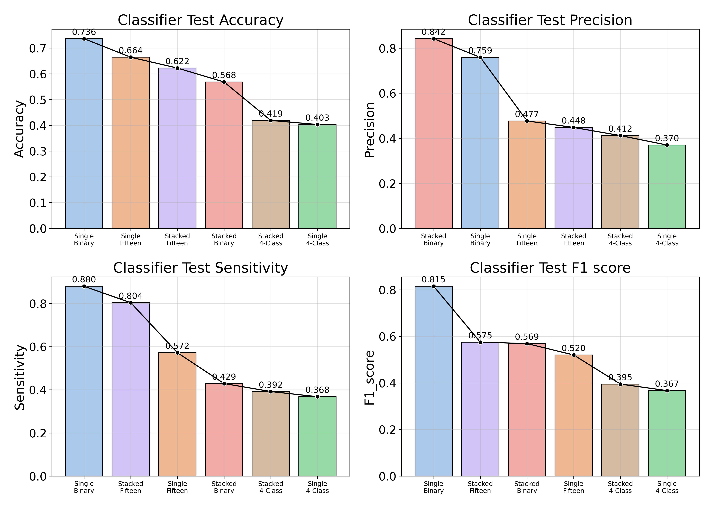

# OSA Severity Prediction Pipeline

The overall goal of this study is to determine how well the AHI captures patients’ subjective experience of OSA, and to test whether machine-learning models can improve on AHI‐based severity classification by incorporating patient‐reported symptoms and detailed respiratory event metrics.  

## Model Architecture
To predict OSA severity from both questionnaire responses and polysomnographic indices, we developed a hybrid machine learning pipeline structured around three modeling strategies. Each strategy uses the same preprocessed input features derived from four domains: Medical History (MH), Sleep Assessment (SA), Pre-Sleep (PreS), Post-Sleep (PostS), and total sleep time. All binary features of each questionnaire section underwent dimensionality reduction via \ac{PCA} prior to training.

A) OSA regression via XGBoost with regression objectives. 

B) OSA classification into severity strata (e.g., binary or four-class) using softprob/logistic loss. 

C) A hybrid stacked pipeline in which five intermediate regressors (OA, CA, MA, HYP, RERA per hour) are trained individually, and their predictions are fed into a second-stage classifier to predict overall OSA severity.}

## Performance 

### Regression 
Both the single-stage (Base Regressor) and the two-stage stacked model achieved similar error metrics on the test set, with RMSE, MedAE, explained variance ($\sigma^2$), and adjusted $R^2$ of 18.4, 2.5, 0.13, and 0, respectively, as shown in Figure 1. This indicates that the stacked model for the event-index regressor does not substantially reduce overall AHI error nor increase the variance explained. Performance of the models across all data splits is presented in `results\regres_classif_xgboost_summary`.

### Classification 
The following Figure compares test‐set performance across our six classification models. The single‐stage binary classifier achieves the highest overall discrimination (accuracy = 0.736, precision = 0.759, sensitivity = 0.880, F1 = 0.815), whereas its stacked counterpart trades off sensitivity for precision (accuracy = 0.568, precision = 0.842, sensitivity = 0.429, F1 = 0.569). In the fifteen‐class task, stacking boosts sensitivity (0.804 vs. 0.572) and F1 (0.575 vs. 0.520) at the expense of accuracy (0.622 vs. 0.664) and precision (0.448 vs. 0.477). Both single‐stage and stacked four‐class models perform least well—accuracies hover around 0.40 with F1 scores below 0.40—though the stacked version yields modest gains across all four metrics. Full results for all splits are reported in  `results\regres_classif_xgboost_summary`.

---

## 📁 Repository Structure

- `regression_class_xgboost.py`  
  Train and stack XGBoost regressors and classifiers to predict OSA severity from respiratory features and derived indices. Includes Optuna tuning, stratified validation, and stacking logic.  
  **[XGBoost | Regression + Classification | Optuna | Stacking]**

- `regression_class_fcnn.py`  
  Deep learning pipeline using fully connected neural networks (FCNNs) to predict OSA components and final severity via stacking. Includes Optuna hyperparameter tuning, CV logging, and TensorBoard integration.  
  **[PyTorch | Deep FCNN | Regression + Classification | TensorBoard]**

- `visual_regression_class_xgboost.py`  
  Visualization script to compare classifier and regressor performance across multiple trained models. Plots include bar + line overlays for metrics like RMSE, R², accuracy, precision, and more.  
  **[Visualization | Matplotlib + Seaborn | Auto-wrapped labels | Multi-metric plots]**

- `variance_decompostion.py`  
  Tools for analyzing multicollinearity, PCA/MCA decompositions, and their impact on XGBoost model performance. Includes VIF plots, scree plots, and category loading heatmaps.  
  **[Dimensionality Reduction | VIF | PCA | MCA]**

- `regression_signifiance_test.py`  
  Statistical inference pipeline using linear regression to evaluate the contribution of individual features (e.g., questionnaire items) to AHI. Outputs ORs, p-values, and forest plots.  
  **[Inference | Statsmodels | Forest Plots]**

- `sleep_perception.py`  
  Statistical analysis of subjective sleep perception vs objective severity. Includes paired Wilcoxon, McNemar tests, Kruskal–Wallis, and effect size visualizations.  
  **[Epidemiology | Non-parametric Tests | Stratified Analysis | Effect Sizes]**

- `table_ones.py`  
  Generates descriptive statistics tables ("Table 1") and adjacent-group effect size comparisons using Cliff’s Delta. Outputs Excel and forest plot summaries.  
  **[Descriptive Stats | Forest Plots | Effect Size]**

---

## 🧠 Key Features

- ✅ Supports both **regression** and **classification** tasks for OSA.
- ✅ Combines **objective PSG features** with **questionnaire data**.
- ✅ Implements **advanced hyperparameter tuning** with Optuna.
- ✅ Compatible with **PCA/MCA-reduced input** or feature-expanded data.
- ✅ Modular design for easy extension and evaluation.

---
